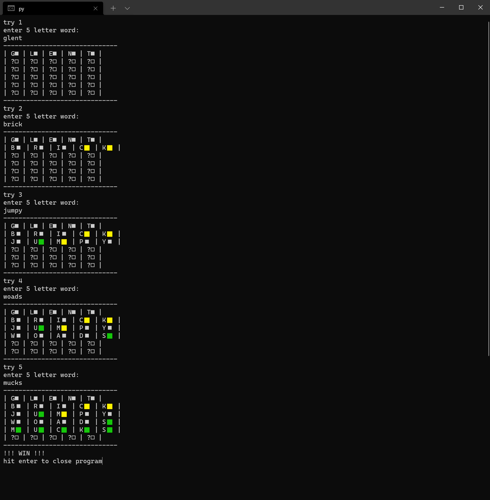

# wordlegame
a terminal version of the wordle game

## requirments
Windows Terminal (it opens in windows terminal to display the emojis)
and python

## how to run
run ```launcher.cmd```
or run ```main.py```

## image/screenshot

